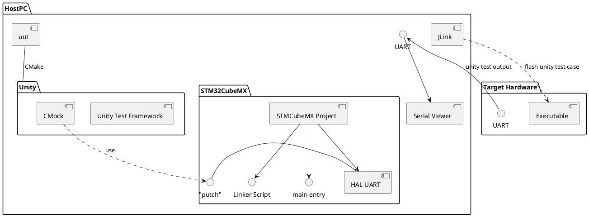

# stm32h743_hal
 Hardware Abstraction Layer for the STM32H743-eval2 board project. Autogenerated code and scripts along with project structures are kept here.
 Each git branch is protected by design not to merge to main.

## Function diagram
[Component diagram][6] is as below


## STM32CubeMx
This fork maintains the hardware drivers for the evaluation board, [stm32h743ieval2][5].

The project file is inside the folder `cubemx` with name `eval2.ioc`. The project generated is a `Makefile` project that generates:

 1. Core
    * _peripheral level drivers_
    * _interrupt vector callbacks_
    * _`main` entry file (Optional)_
 2. CMSIS
    * _device and vendor specific drivers_
 3. STM32H7xx_HAL_Driver
    * _low level drivers_
 4. Startup assembly code
 5. STM32H743XIHx_FLASH.ld
    * _simple linker script for ARM GCC_

## Workflow
1. Use [`STM32CubeMx`][3] to modify the settings of the hardware driver as desired and generate the code using the tool.
2. Cross compile the library using the necessary toolchain file in the `cmake` folder.
3. Provide implementation for
   | Function Prototype | Description |
   |--|--|
   | `void app_main(void)` | Entry for application handover. |

4. Provide the following CMake Cache variables to use the correct branch and the target hardware.
   | CMake Cache Variable | Description |
   |--|--|
   | `GITHUB_BRANCH_HAL` | Branch on which the hal should compile; e.g. _prototype\_a_ |
   | `BOARD_TYPE` | One of the three possible target hardware `stm32h743ieval2` or `x84_64` |

   > _Note_
   >
   > `x86_64` is not a real target; only used for Test builds for mocking the hal interfaces.

## Configure steps

__Debug (_eval board_)__

```shell
cmake -S. -Bbuild -DCMAKE_TOOLCHAIN_FILE=./cmake/gcc_cortexM7.cmake -DCMAKE_BUILD_TYPE:STRING=Debug -G Ninja
```

__Release (_eval board_)__
```shell
cmake -S. -Bbuild -DCMAKE_TOOLCHAIN_FILE=./cmake/gcc_cortexM7.cmake -DCMAKE_BUILD_TYPE:STRING=Release -G Ninja
```

## Build steps

__Debug (_eval board_)__
```shell
cmake --build build --config Debug -j
```
__Release (_eval board_)__
```shell
cmake --build build --config Release -j
```
## Build Artefact
The fork gives hardware abstract layer as

| Artefact | Description |
|--|--|
| `libhal.a` | Static library of all sources part of the C and assembly sources |
| `${hal_LINKER_SCRIPT}` | Exported variable for the application to find the name of the linker script |
| `${hal_LINKER_PATH}` | Exported variable for the application to find the linker script in a path |

## Project Integration

The `CMakeList.txt` file at top can be invoked by application using [ExternalProject_Add][2] or [FetchContent][4].

[1]: ./schematics/fwd_sch_47527-100_a04.pdf
[2]: https://cmake.org/cmake/help/latest/module/ExternalProject.html
[3]: https://www.st.com/en/development-tools/stm32cubemx.html
[4]: https://cmake.org/cmake/help/latest/module/FetchContent.html
[5]: https://www.st.com/en/evaluation-tools/stm32h743i-eval.html
[6]: https://plantuml.com/plantuml/png/VPDHQzim483VzIiElxSFsziOfILiX950MT8nC4OeohbnRSj6EYqre_zzijp9gjNcqNVVdRwpTBU6X2RRDgmNiXQF2DcwCtI_ok0l0m3PjNsdK15aFpQLgZCG1awEu4-D-rmWEzILQE1NXMVKCshT4VoF3uu5bIBKfP08sSFTp_rRRj7HMl9vgogNLqVKdD0G6x5WlDjlFtzQsGDkVxzgnqryVih2lUwUK4ujfGlnVWfCDR7PE2ngs4bTzH6_sQLeAoe5xY0zpDmOIqNMTni88tik9FtmQU-ijoHFsKS5d9xvOI1axBKqZwSguEhg9l59aSLeAN31DKzJOyr5MG1uUNE13-vsXtUlpcTWZuRWknOjdZjTXmSnyF9_BArSRJiPex9rt-7eF0eMS7rzSqaOle0r6ChcT-Z_3dX7nwoseaRsmkPLsWlzY0HheOzdeJ7TgM_FA2s9GuFUb3pFiIdVtPD0U3jtKjWQ-EeyejnexAr6IUWizPPcsbzflbpDWkNpOa__99-52jUoR8GvnOsbCCXkKHrjs_m3